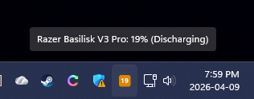
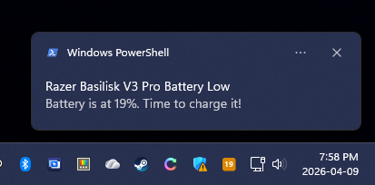

# Razer Battery Monitor

A lightweight Windows system tray app that shows your Razer wireless device battery levels and alerts you when they get low — because Razer Synapse won't.

Creates one tray icon per device that reports battery information, color-coded by charge level.



---

## Features

- One tray icon per Razer device with a battery, labeled with the device name
- Color-coded percentage display — green, blue, orange, or red based on charge level
- Charging indicator (dot) when a device is on the dock
- Windows toast notification when battery drops to/below a configurable threshold
- Alerts once per discharge cycle — silences until you charge and discharge again
- Auto-detects Synapse 3 or 4



---

## Requirements

- Windows 10 or 11
- Python 3.10+
- Razer Synapse 3 or 4 (must be running — the app reads its log file)

---

## Quick Setup

```
git clone https://github.com/yourname/synapse-battery-mon.git
cd synapse-battery-mon
python setup_monitor.py
```

The setup script installs dependencies and optionally creates a Startup folder shortcut so the monitor launches at login.

---

## Manual Setup

```
pip install -r requirements.txt
pythonw battery_monitor.pyw
```

Use `pythonw` (not `python`) to run without a console window.

---

## Options

| Flag | Default | Description |
|------|---------|-------------|
| `--threshold N` | `30` | Alert at this battery percent |
| `--poll-interval N` | `2` | Seconds between log file checks |
| `--alert-cooldown N` | `300` | Min seconds between repeated alerts |
| `--synapse 3\|4\|auto` | `auto` | Which Synapse version log to read |
| `--debug` | off | Print log messages to console |

### Examples

```
pythonw battery_monitor.pyw --threshold 20
pythonw battery_monitor.pyw --synapse 4 --debug
```

---

## How It Works

Razer Synapse writes device state continuously to a log file. This app tails that file, parses battery entries as they appear, and updates each device's tray icon accordingly.

**Synapse 4** logs include a full JSON device list per entry, which contains the device name, battery level, and charging status for every connected device. One tray icon is created per device that reports battery data.

**Synapse 3** logs use an older format (`level N state N`) with no device name — a single icon labeled "Unknown Device" is shown instead.

Log file locations:

| Version   | Path                                                                          |
| --------- | ----------------------------------------------------------------------------- |
| Synapse 3 | `%LOCALAPPDATA%\Razer\Synapse3\Log\Razer Synapse 3.log`                       |
| Synapse 4 | `%LOCALAPPDATA%\Razer\RazerAppEngine\User Data\Logs\systray_systrayv2*.log`   |

---

## Tray Icon Colors

| Color      | Range    | Meaning                          |
| ---------- | -------- | -------------------------------- |
| Green      | 61–100%  | Healthy                          |
| Blue       | 31–60%   | Moderate                         |
| Orange     | 16–30%   | Low                              |
| Red        | 0–15%    | Critical                         |
| Dark blue  | any      | Charging (yellow dot indicator)  |
| Gray `?`   | —        | No data yet                      |

---

## Auto-Start at Login

Run setup again and choose **Y**:

```
python setup_monitor.py
```

This creates `RazerBatteryMonitor.vbs` in your Windows Startup folder:

```
%APPDATA%\Microsoft\Windows\Start Menu\Programs\Startup\
```

To remove it, run setup and choose **R**, or delete the `.vbs` file manually.

---

## Troubleshooting

**"Waiting..." icon and nothing updates**  
Synapse hasn't written a battery entry yet. Move your mouse — an entry should appear within a few seconds. Run with `--debug` to see what's being read.

**Wrong Synapse version detected**  
Use `--synapse 3` or `--synapse 4` to force a specific version.

**No toast notification appeared**  
This app uses PowerShell to fire notifications without needing a registered AppUserModelID. Confirm PowerShell is not blocked by policy: `powershell -Command "Write-Host test"`.

**Device shows but wrong name**  
Device names come directly from the Synapse log. The English name from Synapse is used.
